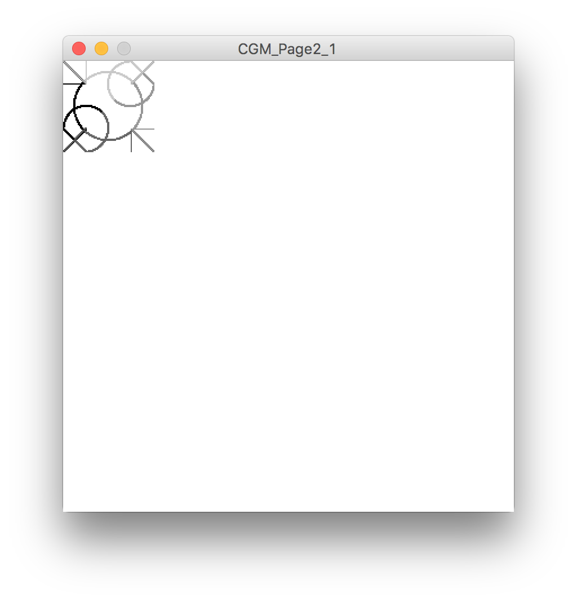
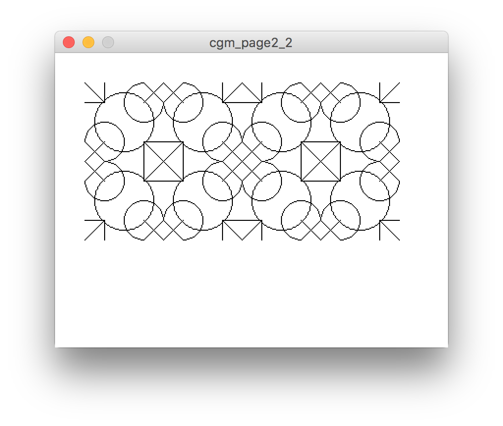

# Computer Geometric Art

This is a book by Ian Angell, published in 1985, with many examples of repeating geometric patterns created using a series of Fortran programs written by the author. 

According to the introduction:

> To draw a lattice pattern, the computer first has to generate a "tile"; the computer takes an elementary set of line segments and arcs, and manipulates them using a space group (a sequence of reflections, rotations and translations on the original set) into a tile, which introduces some initial symmetry. The tiles are then stacked in a regular lattice ... thus initiating further symmetries. ... Clipping is used to restrict the pattern to a finite rectangle.

## Making one tile

I picked a pattern (on page 2) to see if I could replicate this process in Processing, and perhaps also plot it out...

### Sketch: [`cgm_page2_1.pde`](cgm_page2_1/cgm_page2_1.pde)

This sketch draws one tile, comprised of 4 sub-tiles. I used different colours for each quadrant to help me debug the translations and get them to line up properly.

 

## Nesting tiles, and controlling transformations

This works fine for one tile, but as this excellent video explains, "translations accumulate"

[The Coding Train: Transformations Pt.1 (Translate, Rotate, Push/Pop) - p5.js Tutorial](https://www.youtube.com/watch?v=o9sgjuh-CBM)

<iframe width="560" height="315" src="https://www.youtube.com/embed/o9sgjuh-CBM?rel=0" frameborder="0" allow="autoplay; encrypted-media" allowfullscreen></iframe>

So ever time I rotate, move or flip a tile, I need to reset the matrix. 

### Sketch: [`cgm_page2_2.pde`](cgm_page2_2/cgm_page2_2.pde)

This sketch builds on the previous one in a couple of ways:

1. It uses `popMatrix()` and `pushMatrix()` between each transformation to reset the canvas to it's defaults, which makes the translations easier to calculate
2. It uses nested objects; each tile is an object, and each space group is also an object made up of 4 tiles
3. It also uses a few functions to tidy up the code and reduce CPU usage, since I'm not doing any animation

The result:

 