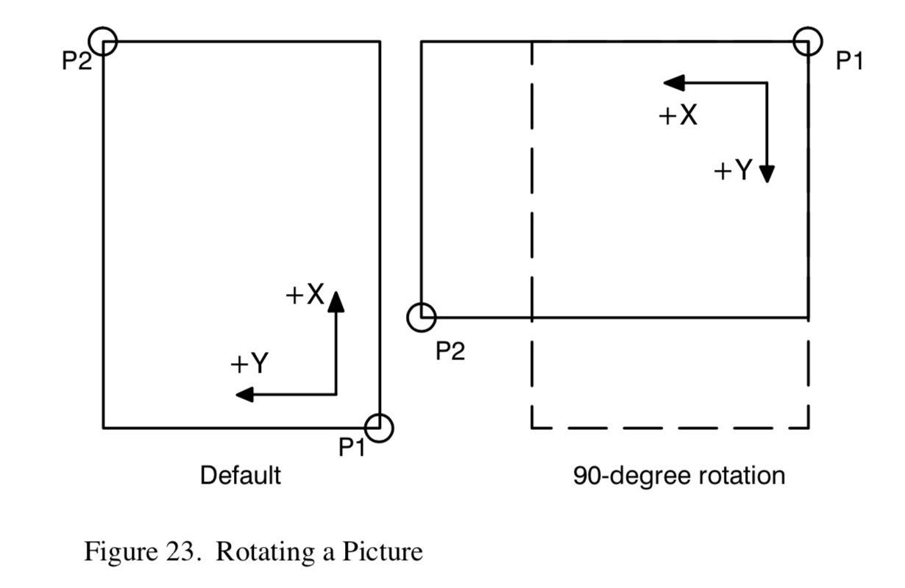
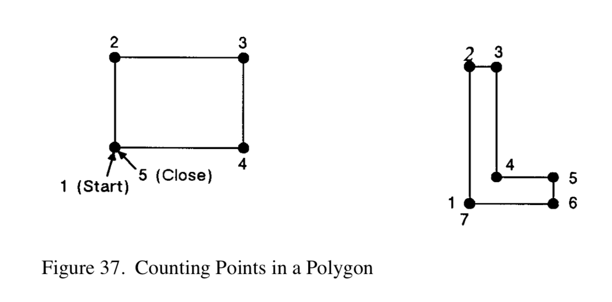

# Getting started with the pen plotter

I bought an HP745 pen plotter off eBay. I'm trying to program it using Processing. 


## Serial Port

First, we have to figure out which port it's on:

```processing
import processing.serial.*;
println(Serial.list()); //Print all serial ports to the console
```

I have 2 USB A ports on my Macbook Pro. For some reason, the one on the right often doesn't work for these kinds of serial communication tasks (I often can't get it to work when uploading to an Arduino either...) 

When I have the plotter connected (via a [USB to RS232 DB9 Adapter](https://www.amazon.co.uk/dp/B00QUZY4L0)) to the right side USB port, I get this list:

```
/dev/cu.AndrewsiPad-WirelessiAP 
/dev/cu.AndrewsiPhone2-Wireless 
/dev/cu.Bluetooth-Incoming-Port 
/dev/tty.AndrewsiPad-WirelessiAP 
/dev/tty.AndrewsiPhone2-Wireless 
/dev/tty.Bluetooth-Incoming-Port
```

On the left side, I get this list:

```
/dev/cu.AndrewsiPad-WirelessiAP 
/dev/cu.AndrewsiPhone2-Wireless 
/dev/cu.Bluetooth-Incoming-Port 
/dev/cu.usbserial-A106Z4UW 
/dev/tty.AndrewsiPad-WirelessiAP 
/dev/tty.AndrewsiPhone2-Wireless 
/dev/tty.Bluetooth-Incoming-Port 
/dev/tty.usbserial-A106Z4UW
```

I need to use the last port on that list, which is index 7 in the array.


## Origin

The plotter's origin can be reset using HPGL commands, however, according to the HPGL reference guide:

> The default origin (0,0) depends on the type of device, and is shown on page 10. (PCL dual-context uses the PCL default logical page coordinate system).


On my plotter, the origin is at the top left corner of the page. For an A4 sheet, which is loaded sideways into the plotter, that means that for a portrait plot, the origin is somewhat confusingly in the corner that appears to be in the bottom left. 

**Question: how do you switch it to landscape?**

P. 40:



> Plotters always set the X-axis parallel to the longest edge of your plot; small-format printers set the Y-axis parallel to the longest edge. However, you can change this orientation using the RO (Rotate Coordinate System) instruction to rotate the coordinate system counterclockwise 90°, 180°, or 270°. Figure 23 shows the default, for most HP-GL/2 devices, and rotated orientation of the axes and locations of P1 and P2.
Note that P2 is now off the page. This occurs because the X, Y coordinates of P1 and P2 do not change. To set P1 and P2 at the hard-clip limits, use either the IP or IR instruction after the RO instruction; see page 275 for more information. If you reset your coordinate system to its de- fault orientation, remember to reset P1 and P2, using either the IP or IR instruction again.

## Drawing polygons

I think this might be important (p.53):

> Counting the Points in a Polygon
The starting pen location and each subsequent point define a polygon. As shown in the follow- ing illustration, a rectangle is defined by five points, not four. This is because the starting location is counted again as the ending location. The second shape has seven points.





## Labels

It's not clear to me what you put in the Label (LB) command to finish a string of text. DO you actually put the letters ETX? Interestingly BBEdit displays this character, copied-and-pasted from Preview, as Shift-Return

> Terminating Labels
LB tells the device to print every character following the instruction, rather than interpreting the characters as graphics instructions. In order to allow the normal terminator, the semicolon (;), to be used in text, the instruction is defined so that you must use the special label terminator to tell the device to once again interpret characters as graphics instructions. (If the instruction had been defined otherwise, you wouldn’t be able to print semicolons in your text.)The default label terminator is the non-printing ASCII end-of-text character ⇧↵ (decimal code 3, and denoted in BASIC by CHR$(3)). You must use the label terminator, or the device prints the rest of your file as text instead of executing the instructions. You can change the label ter- minator using the DT (Define Label Terminator) instruction.

## Asteroid field

I'd like to generate an image of asteroids, roughly in a grid, and each varying in size and shape.

Working from the Symbolic Disarray code, I'm creating my own `Asteroid()` class, and then using parameters passed to it when initialising each object in the array to introduce variations.

In plain old Processing, this would be quite simple. You could use `pushMatrix()` and `popMatrix()` to apply translations to each object as it's created, then reset the canvas for the next one. 

But the screen display for me is secondary. I want to generate HPGL for each line, so the position of each point on the line needs to be calculated in absolute terms, not relative to a canvas which has been transformed. 

This makes a simple rotation complex.

### Sketch: [`pvectors_asteroids_5.pde`](pvectors_asteroids_5/pvectors_asteroids_5.pde)

In this sketch I'm trying to rotate each asteroid a random amount, but display them in an even grid. The problem is that the rotation function moves each point around an origin, messing up the grid:


The solution is to draw each asteroid with an origin at its center. In my case, with an asteroid being drawn within a 8 x 8 square, that means the top left point is at `-4, -4`, and the botom right point at `4, 4`:

```processing
asteroidPoints.add(new PVector(-4,-4) );
asteroidPoints.add(new PVector(-2+random(-ran,ran),-3+random(-ran,ran)) );
asteroidPoints.add(new PVector(1+random(-ran,ran),-2+random(-ran,ran)) );
asteroidPoints.add(new PVector(2+random(-ran,ran),0+random(-ran,ran)) );
asteroidPoints.add(new PVector(2+random(-ran,ran),1+random(-ran,ran)) );
asteroidPoints.add(new PVector(1+random(-ran,ran),2+random(-ran,ran)) );
asteroidPoints.add(new PVector(1+random(-ran,ran),3+random(-ran,ran)) );
asteroidPoints.add(new PVector(0+random(-ran,ran),4+random(-ran,ran)) );
asteroidPoints.add(new PVector(-2+random(-ran,ran),4+random(-ran,ran)) );
asteroidPoints.add(new PVector(-4+random(-ran,ran),2+random(-ran,ran)) );
asteroidPoints.add(new PVector(-4+random(-ran,ran),1+random(-ran,ran)) );
asteroidPoints.add(new PVector(-5+random(-ran,ran),-1+random(-ran,ran)) );
asteroidPoints.add(new PVector(-4,-4) );
```


