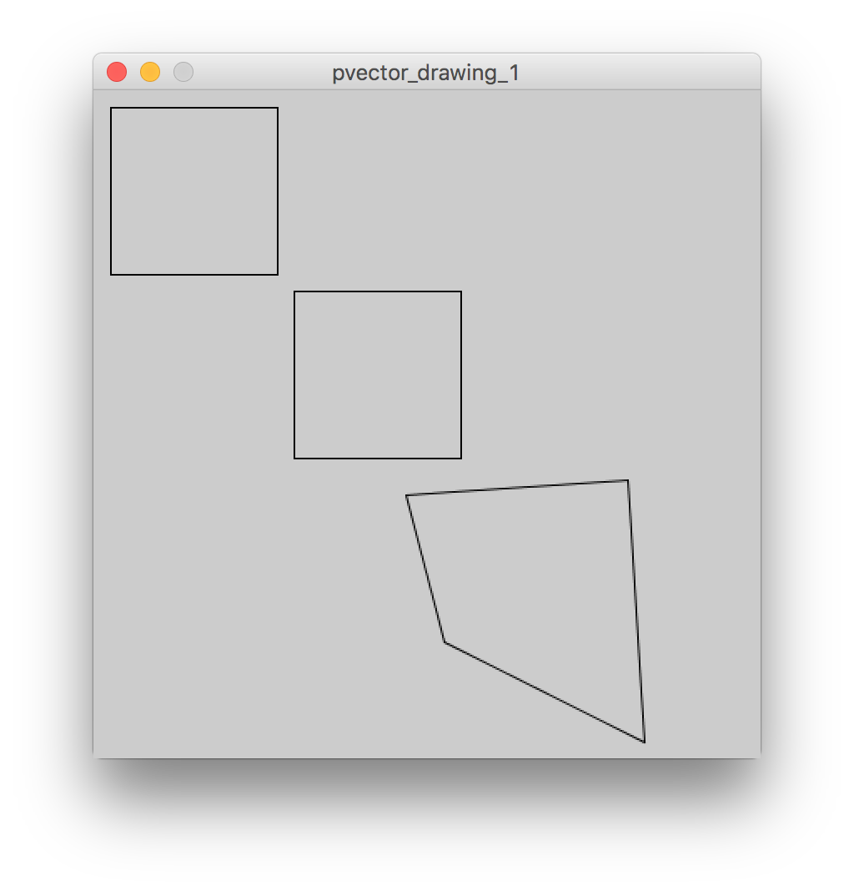
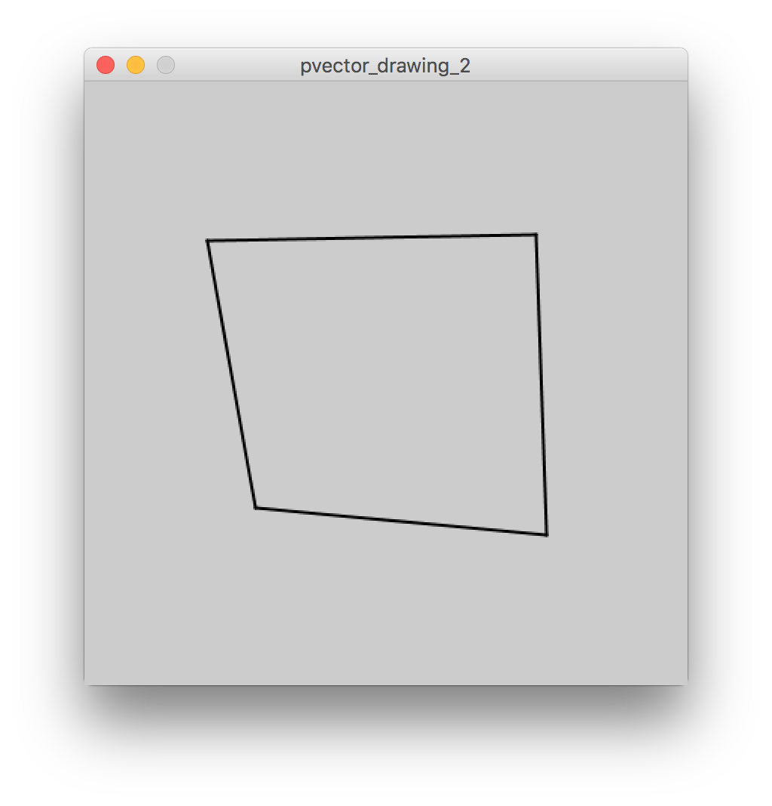

# PVectors

PVectors are commonly used for animation, but they can also be used to connect two points – or indeed a set of points – together.

### Sketch: [`pvector_drawing_1`](pvector_drawing_1/pvector_drawing_1.pde)

This is a sketch that draws a square on screen using 3 methods:
1. Drawing a series of lines between each point
2. Setting up vectors from each point to the next, then drawing lines along these vectors
3. Doing the same, but adding some skewing to the vectors, while still completing the loop of the (now warped) square.

  
### Sketch: [`pvector_drawing_2`](pvector_drawing_2/pvector_drawing_2.pde)

IN this second version, I just used the `PVectorWarpedSquare` object and initialised it in the `draw()` function so that a new warped square would be drawn on each refresh.

I added a randomness factor to the object definition so that it would be different each time.

<video src="pvector_drawing_2_animation.mov" controls="" preload="" loop="loop"></video>